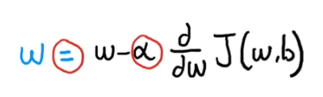
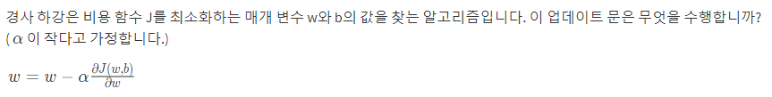
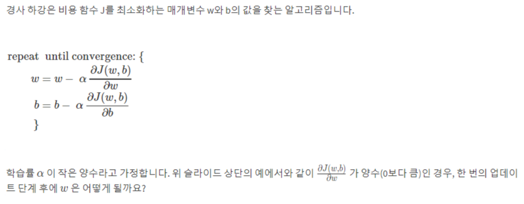
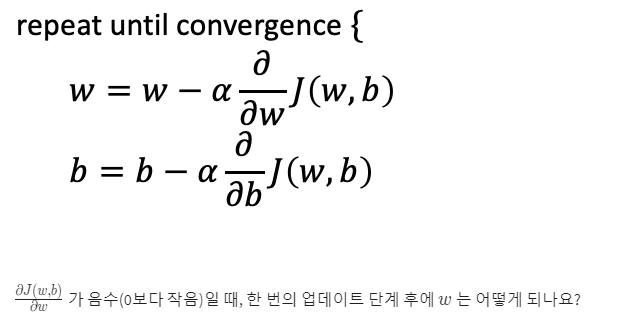
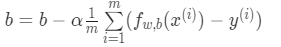
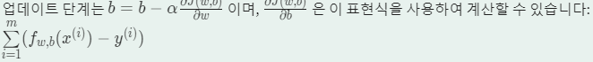

# Coursera Stand-ford Online Machine Learning 1 week

##### 1. 머신 러닝 개요

- **머신 러닝의 응용 분야**
  - 웹 검색, 사람의 음성 인식, 자율 주행 자동차 제작, 결제 사기 퇴치 등


##### 2. 지도형 머신 러닝과 비지도형 머신 러닝 비교

- 머신 러닝의 두 가지 주요 유형은 `지도형 머신 러닝`과 `비지도형 머신러닝`

- **지도형 머신 러닝**

  - x에서 y로 또는 입력과 출력의 매핑을 학습하는 알고리즘
  - 정답이 있는 학습 알고리즘 예제를 통한 학습
  - 더 많은 정답을 많이 산출하는 것이 `지도형 머신 러닝`의 역할

  - 분류 알고리즘은 범주를 예측함
  - 가장 중요한 두가지 유형은 회귀와 분류
    - 회귀
      - 알고리즘이 무한히 많은 출력 수치를 바탕으로 숫자를 예측
    - 분류
      - 범주를 예척해야 함
      - 가능한 출력의 작은 집합만 포함
  
- **비지도 머신 러닝**

  - 데이터에 어떤 출력 레이블과도 연관되지 않은 데이터를 사용

  - 예를 들어, 종양의 크기와 환자의 나이와 같은 데이터를 가지고 있지만 종양이 양성인지 악성인지는 알 수 없는 경우

    - 이러한 데이터를 사용하여 데이터의 구조나 패턴을 찾는 것이 비지도 학습의 목표

  - **클러스팅 알고리즘**은 일종의 비지도 러신 머닝

    - 레이블이 없는 데이터를 가져와서 자동으로 클러스터로 그룹화 하는 것

  - 데이터가 x만 입력되고 출력 레이블 y는 제공되지 않음

  - **예외 항목 탐지** (이상 탐지)

    - 비정상적인 이벤트를 탐지 할 때 사용
    - 금융 시스템에서 사기 탐지를 위해 이상 탐지 사용

  - **차원 축소**

    - 큰 데이터셋을 더 작은 차원으로 압축하는 방법
    - 데이터를 시각화하거나 계산 비용을 줄일 수 있음

  - **연관 규칙 학습**

    - 데이터에서 항목간의 연관성을 찾아내는 방법
    - 슈퍼마켓에서 고객의 구매 패턴을 분석하여 상품 간의 연관성을 파악

  - ##### 차이점 탐지

    - 데이터의 서로 다른 그룹 간의 차이점을 찾아내는 방법
    - 의료 데이터에서 건강한 사람과 질병을 가진 사람의 차이점을 분석


##### 3. 회귀 모델

- **선형 회귀 모델**
  - 데이터에 직선을 맞추는 것을 의미
  - 주어진 데이터를 기반으로 학습하여 예측하는 것
  - 회귀 문제를 해결하는 모델 중 하나이며, 회귀 문제는 숫자를 예측하는 문제
  
- **분류 모델**

- 훈련 세트
  - **모델을 학습하는 데 사용**하는 데이터 세트
  - 모델은 훈련 세트의 입력과 출력을 분석하여 패턴을 학습하고 최적의 매개 변수를 찾음
  - 훈련 세트는 모델이 학습하는 데 사용되므로 정확한 출력(레이블 또는 타겟 값)이 제공
  
- **테스트 세트**
  - **학습된 모델의 성능을 평가하는 데 사용**되는 데이터 세트
  - 모델이 이전에 본 적이 없는 새로운 데이터를 입력으로 받아 예측을 수행하고, 이 예측 결과를 실제 출력과 비교하여 모델의 정확도를 측정
  - 모델의 일반화 능력을 평가하기 위해 사용되며, 모델이 이전에 본 적이 없는 데이터에 대해 얼마나 잘 예측하는지를 확인

- **용어 설명**
  - y-hat 
    - y에 대한 추정값 또는 예측 값
  - y
    - 훈련 세트의 실제 참값인 목표값
  - f는 함수
  
- 학습 알고리즘을 설계할 때 가장 중요한 것은 **함수 f를 어떻게 표현할 것 인가**
  - 함수는 `f_w`로 작성할 수 있음
  - ex)
    - f<w, b>(x) = wx + b 라고 정의 가능
      - w와b를 아래 첨자에 명시적으로 포함시키지 않고 x의 f만 쓰기도 함 -> `f(x)`
    - w와b는 숫자
    - 입력 특징 x를 기반으로 예측 `y-hat`을 결정

- 실습

  - 데이터 플롯을 위한 라이브러리 `matplotilb`

  - 변수에 배열 저장

    - ```python
      x_train = np.array([1.0, 2.0])
      y_train = np.array([300.0, 500.0])
      print(f"x_train = {x_train}")
      print(f"y_train = {y_train}")
      
      # 결과 값
      x_train = [1. 2.]
      y_train = [300. 500.]
      ```

  - Numpy 배열에 .shape 매개 변수 사용

    - x_train.shape는 각 차원에 대한 항목이 있는 파이썬 튜플을 반환

    - x_train.shape[0]은 아래와 같은 배열의 길이와 예제의 수

    - ```python
      # m is the number of training examples
      print(f"x_train.shape: {x_train.shape}")
      m = x_train.shape[0]
      print(f"Number of training examples is: {m}")
      
      # 결과 값
      x_train.shape: (2,) # 2, 0 한 배열의 2개의 값과, 0개가 있다는 것
      Number of training examples is: 2 # 배열의 길이
      ```

  - 배열의 길이

    - ```python
      # m is the number of training examples
      m = len(x_train)
      print(f"Number of training examples is: {m}")
      
      # 결과 값
      Number of training examples is: 2
      ```

  - 훈련 예제 `x_i`,`y_i` 

    - ```python
      i = 0 # Change this to 1 to see (x^1, y^1)
      
      x_i = x_train[i]
      y_i = y_train[i]
      print(f"(x^({i}), y^({i})) = ({x_i}, {y_i})")
      
      # 결과 값
      (x^(0), y^(0)) = (2.0, 500.0)
      ```

  - 데이터 플롯

    - 아래 셀과 같이 매트플롯립 라이브러리의 `scatter()`를 이용해 이 두 점을 플롯할 수 있음

    - 함수 인수 마커와 c는 점을 빨간색 십자가로 표시(기본값은 파란색)

    - 매트플롯립 라이브러리의 다른 기능을 사용하여 표시할 제목 및 레이블을 설정할 수 있음

    - ```python
      # Plot the data points
      plt.scatter(x_train, y_train, marker='x', c='r')
      # Set the title
      plt.title("Housing Prices")
      # Set the y-axis label
      plt.ylabel('Price (in 1000s of dollars)')
      # Set the x-axis label
      plt.xlabel('Size (1000 sqft)')
      plt.show()
      
      # marker는 그래프에 표시 모양
      # c는 색깔
      ```

    - 결과 값

      

  - `𝑓𝑤,𝑏(𝑥(𝑖))=𝑤𝑥(𝑖)+𝑏(1)` = 직선을 나타내는 방법

    - ```python
      w = 100
      b = 100
      print(f"w: {w}")
      print(f"b: {b}")
      ```

    - 이제 `𝑓𝑤, 𝑏(𝑥(𝑖))`의 값을 계산해 보겠습니다
      두 개의 데이터 포인트에 대해. 각 데이터 포인트에 대해 다음과 같이 명시적으로 작성할 수 있습니다 -

      𝑥(0)의 경우
      `f_wb = w * x[0] + b`

      𝑥(1)의 경우
      `f_wb = w * x[1] + b`

    - 많은 수의 데이터 포인트의 경우, 이것을 다루기 힘들고 반복적이여서 아래와 같은 함수와 같이 for 루프에서 함수 출력을 통해 계산

      - ```python
        def compute_model_output(x, w, b):
            """
            Computes the prediction of a linear model
            Args:
              x (ndarray (m,)): Data, m examples 
              w,b (scalar)    : model parameters  
            Returns
              f_wb (ndarray (m,)): model prediction
            """
            m = x.shape[0]
            f_wb = np.zeros(m)
            for i in range(m):
                f_wb[i] = w * x[i] + b
                
            return f_wb
        ```

      - m은 훈련 예제 수

      - `np.zeros(m)` m에 있는 1차원 Numpy 배열을 반환

        - 즉, 여기에서는 `x.shape[0]`에 있는 배열을 반환

      - 해당 함수를 호출하면

      - ```python
        tmp_f_wb = compute_model_output(x_train, w, b,)
        
        # Plot our model prediction
        plt.plot(x_train, tmp_f_wb, c='b',label='Our Prediction')
        
        # Plot the data points
        plt.scatter(x_train, y_train, marker='x', c='r',label='Actual Values')
        
        # Set the title
        plt.title("Housing Prices")
        # Set the y-axis label
        plt.ylabel('Price (in 1000s of dollars)')
        # Set the x-axis label
        plt.xlabel('Size (1000 sqft)')
        plt.legend()
        plt.show()
        ```

      - 결과 값

        

      - 직선을 그리기 위한 함수를 호출하여 `plot`을 통해 그려주어서 파란색과 같은 직선이 나타나게 됨

      - 하지만, `w = 100`, `b = 100`으로 선정했을 때, 빨간석 점의 데이터와 맞는 선을 생성하지 않음

      - 다양한 `w`값과 `b`의 값을 통해 찾아야함

      - `w = 200`, `b = 100`으로 선정하여 함수를 돌린 결과

        

      - 데이터의 맞는 올바른 직선을 그릴 수가 있게 되었음
      
      
  
- ##### 비용 함수 공식

  - 비용 함수는 모델의 성능을 측정하여 더 나은 결과를 얻을 수 있도록 도와줌

  - 선형 회귀에서는 입력 특성 x와 출력 타켓 y를 포함하는 학습 세트가 있음

  - 이 학습 세트를 적합시키기 위해 사용할 모델은 `f_w, b(x) = w*x + b`와 같은 선형 함수

  - 여기서 `w`와 `b`는 모델의 매개변수로, 학습 중에 조정할 수 있는 변수,  `w`와 `b`는 `가중치` 또는 `계수`로도 불림

  - 선형 회귀에서는 모델 f로부터 얻은 직선이 학습 데이터와 잘 맞도록 w와 b의 값을 선택하려고 함

  - 이 직선이 학습 데이터에 잘 맞는다는 것은 다른 가능한 직선에 비해 학습 예제에 근접하거나 근처에 있다는 것을 의미

  - 비용 함수는 이러한 직선이 학습 데이터에 얼마나 잘 맞는지를 측정

- ##### 비용 함수 직관

  - 비용 함수는 모델의 매개변수를 최적화하기 위해 사용
  - 모델은 훈련 데이터에 직선을 맞추기 위해 사용되며, 매개변수인 w와 b에 따라 다양한 직선을 얻을 수 있음
  - 비용 함수 J는 모델의 예측과 실제 값인 y의 차이를 측정
  - 선형 회귀에서는 w와 b의 값을 찾아 J를 가능한 작게 만드는 것이 목표
  - 매개변수 w에 대한 다른 선택지와 비교했을 때 모델이 데이터에 상대적으로 잘 맞는 경우는
    - 비용 J가 최소 또는 이에 근접한 경우
    - 비용이 상대적으로 작고 0에 가까우면 다른 선택 사항인 w와b에 비해 모델이 데이터에 더 잘 맞는다는 의미


##### 4. 기울기 하강으로 모델 훈련

- ##### 그라데이션 하강

  - 비용 함수를 최소화 하기 위해 사용되는 알고리즘
  - 초기값으로 설정된 파라미터를 조금씩 업데이트하여 비용 함수를 최소화하는 방향으로 이동
  - 이 과정을 반복하여 최적의 파라미터 값을 찾음
  - `그라데이션 하강`은 선형 회귀와 같은 간단한 모델부터 신경망과 같은 복잡한 모델까지 다양한 모델의 학습에 사용
  - 이를 통해 모델의 성능을 향상시킬 수 있음

- ##### 경사도 하강 구현

  - 

  - 여기서 `a (알파)` 는 `학습률`
  - 학습률은 `0`과 `1` 사이의 작은 양수로 설정되며, 경사 하강 알고리즘에서 얼마나 큰 단계로 내려가는지를 제어함
  - 학습률(알파)이 크면 큰 단계로 내려가는 공격적인 경사 하강 절차를 의미
  - 반대로, 학습률이 작으면 작은 단계로 내려가는 것을 의미
  - 비용 함수 J의 도함수인 미분 항도 중요한 개념
    - 이 미분 항은 경사 하강 알고리즘에서 어느 방향으로 단계를 진행해야 하는지를 결정하고, 학습률과 함께 내려가는 단계의 크기를 결정
  
  
  
  - 해당 업데이트 문은 w 파라미터를 소량 업데이트합니다. 이렇게 하면 비용을 줄이기 위해 파라미터가 소량 업데이트 됨
  
- ##### 그라데이션 하강 직관

  

  - 정답은 `w`가 감소합니다.
    - 이유는 학습률은 항상 양수이므로 w에서 양수를 빼면 w의 새 값은 더 작아짐

  - 경사 하강법은 기계 학습에서 모델의 비용이나 오차를 최소화하기 위해 사용되는 최적화 알고리즘
  - 목표는 예측된 출력과 실제 출력 사이의 차이를 최소화하는 모델의 매개변수 값을 찾는 것
  - **비용 함수**
    - 모델의 오차를 측정하기 위해 비용 함수를 사용
    - 이 함수는 모델의 매개변수를 입력으로 받아 예측된 출력과 실제 출력 사이의 차이를 계산
  - **학습률**
    - 학습률은 매개변수를 업데이트할 때 얼마나 큰 걸음을 나아가는지를 결정하는 매개변수
    - 이것은 알고리즘이 최적해로 수렴하는 속도를 조절
  - **도함수**
    - 도함수는 특정 지점에서 함수의 변화율을 나타내는 수학적인 개념
    - 경사 하강법에서는 비용 함수의 각 매개변수에 대한 도함수를 사용하여 업데이트의 방향과 크기를 결정
  - 경사 하강법을 이해하기 위한 비유는 언덕을 내려오는 것
  - 언덕 위에 서있고 바닥에 도달하려고 함
  - 경사가 가장 가파른 방향으로 작은 걸음을 내딛으며 위치를 조정
  - 학습률은 각 걸음의 크기를 결정하고, 도함수는 경사의 방향과 크기를 알려줌

- ##### 학습 속도

  - 학습 속도가 너무 작은 경우, 경사 하강법은 작동하지만 매우 느리게 작동
  - 매우 작은 단계로 이동하므로 최소값에 도달하기까지 많은 단계가 필요
  - 반대로, 학습 속도가 너무 큰 경우, 경사 하강법은 최소값을 지나쳐 버릴 수 있음
  - 이 경우 경사 하강법은 수렴하지 않거나 발산할 수 있음
  - 따라서, 학습 속도를 적절히 선택하는 것이 중요
    - 학습 속도가 너무 크면 최적값에 도달하지 못할 수 있음
    - 적절한 학습 속도를 선택하여 경사 하강법을 효과적으로 구현할 수 있음

- 문제

  

  - `학습률`이 음수일 때는 `w` 값이 증가하고, 반대로 양수일 때는 감소함

  - 선형 회귀의 경우 매개 변수 b의 업데이트 단계는 무엇?

    

    
