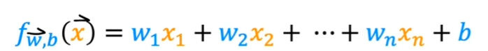
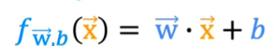
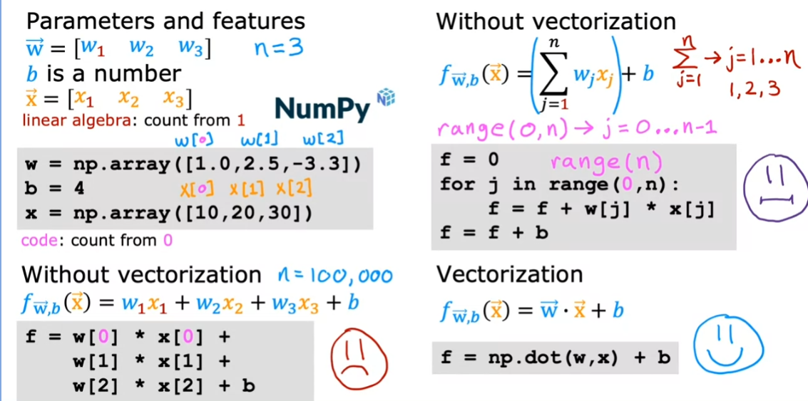

# Coursera Stand-ford Online Machine Learning 2 week

### 다중 선형 회귀

- 첫 번째 식을 두 번째 식으로 표현할 수 있음

- 다중 선형회귀란 하나 이상의 특징을 사용하여 결과를 예측하는 회귀 모델
  - 예를 들어, 집 가격을 예측하기 위해 집의 크기, 침실 수, 층 수, 집의 연식과 같은 여러 가지 특징을 사용할 수 있음

- 다중 선형 회귀 모델은 각 특징에 가중치를 곱한 후 모두 더하여 결과를 예측
  - 예를 들어, 집 가격을 예측하는 모델은 집의 크기에 0.1을 곱한 값, 침실 수에 4를 곱한 값, 층 수에 10을 곱한 값, 집의 연식에 -2를 곱한 값에 80을 더한 값으로 구성
  - 이 가중치는 각 특징이 결과에 어떤 영향을 미치는지를 나타내며, 양수인 경우 해당 특징이 결과를 증가시키는 영향을 가지고, 음수인 경우 감소시키는 영향을 가짐

- 다중 선형 회귀는 하나의 특징만 사용하는 단순 선형 회귀와는 달리, 여러 개의 특징을 사용하여 예측을 수행하는 모델
- 이를 통해 더 복잡한 문제를 다룰 수 있고, 예측의 정확도를 높일 수 있음

### 백터화 파트

- `Python`의 `Numpy` 라이브러리를 사용하여 `dot` 함수를 사용하면 `for`문의 예제를 간단하게 사용할 수 있음
- 벡터화는 코드를 짧게 만들어주고, 실행 속도도 훨씬 빠르게 만들어줌
- 벡터화는 알고리즘을 벡터 형태로 구현하여 계산을 빠르게 수행하는 기술
  - 반복문을 사용하여 알고리즘을 실행하는 경우, 한 번에 하나의 연산을 수행
  - 하지만 벡터화된 코드를 사용하면 컴퓨터가 벡터의 모든 값을 한 번에 처리하여 병렬로 연산을 수행
  - 이를 통해 계산 속도를 크게 향상시킬 수 있음
- 벡터화는 대량의 데이터셋이나 큰 모델을 다룰 때 특히 유용
  - 예를 들어, 기계 학습 알고리즘을 구현할 때 벡터화된 코드를 사용하면 계산 시간을 크게 단축
  - 이를 통해 알고리즘을 효율적으로 실행하고 대규모 데이터셋에 적용 가능
-  벡터화는 기계 학습에서 중요하고 유용한 기술 중 하나이며, 이를 통해 학습 알고리즘을 효율적으로 구현
-  경사도 하강을 약 두 배 빠르게 수렴하게 하려고 학습 속도를 두 배늘리는 것은 잘못된 것

### 실제 경사도 하강

##### 기능 확장 파트

- **특성  스케일링**
  - 경사 하강법(그레이디언트 디센트)가 더 빠르게 작동할 수 있도록 도와주는 기술`
  - EX) `x1`의 값이 크고 `x2`의 값이 작을 때 각자의 값들이 같는 매개변수의 값은 상대적으로 작고 클 것
  - 이렇게 값 범위가 다른 경우, 경사 하강법이 느리게 작동할 수 있음
  - 따라서, 이러한 상황에서는 특성을 스케일링하여 모든 특성이 비슷한 값 범위를 가지도록 변환하는 것이 유용
  - 이렇게 하면 경사 하강법은 전역 최솟값을 더 빠르게 찾을 수 있음
- 기능 확장 중에 사용되는 유효한 단계는
  - 모든 값을 최대값으로 나누면 이제 재조정된 기능의 새로운 최대 범위는 1이됨(다른 모든 재조정된 값은 1보다 작음)

- **수렴을 위한 기울기 하강 확인**

  - 경사하강법은 비용 함수의 전역 최솟값에 가까운 매개변수를 찾기 위해 사용됨
  - 경사 하강법이 잘 작동하는 지 알아보기 위해 비용 함수 J의 값을 각 경사 하강법 반복마다 기록하고 그래프로 그림
    - 해당 그래프를 `학습 곡선`이라 함
    - **학습 곡선**을 통해 경사 하강법이 잘 작동하는 지 확인 가능
    - 제대로 작동한다면 비용 함수 J는 각 반복마다 감소해야 하고 J가 한번의 반복 후에 증가한다면, 이는 학습률 알파가 잘못 선택되었거나 코드에 버그가 있을 수 있음을 의미
      - 여기서 `알파`는 학습 속도
      - 만약에, 비용 함수가 증가하면 경사 하강이 발산되고 있으므로 학습 속도를 낮춰야함
    - 또한 학습 곡선을 통해 경사 하강법이 수렴하는지 확인할 수 도 있음
    - `수렴`이란 비용 함수 J가 더 이상 크게 감소하지 않고 평평해지는 것을 의미
    - 또한, 자동 수렴 테스트를 사용하여 모델 학습이 완료되었는 지 확인 가능
      - 이를 위해, 작은 값이 `Epsilon`을 성정하고, 가 한 번의 반복에서 `Epsilon`보다 작게 감소하면 수렴으로 간주할 수 있음
      - 그러나 `Epsilon`값을 선택하는 것은 어려울 수 있으며, 학습 곡선을 확인하는 것이 더 안정적인 방법

- ##### 학습 속도 선택하기

  - 먼저, 일정한 반복 횟수에 따른 비용을 그래프로 그림
  - 그래프에서 비용이 때로는 증가하고 때로는 감소하는 것을 관찰하면, 그것은 경사 하강법이 제대로 작동하지 않는다는 신호
  - 이는 코드에 버그가 있을 수도 있고, 학습률이 너무 크다는 것을 의미할 수도 있음
  - 학습률이 너무 큰 경우, 업데이트 단계가 최소값을 지나치게 되어 최소값을 지나치게 됨
    - 이로 인해 비용이 감소하는 대신 증가할 수 있음
    - 이를 수정하기 위해 더 작은 학습률을 사용할 수 있음
    - 그러면 업데이트가 조금씩 감소하고 전역 최소값에 도달할 때까지 일관되게 감소할 것
  - 때로는 비용이 반복마다 일관되게 증가하는 것을 관찰할 수도 있음
    - 이는 학습률이 너무 크다는 신호일 수 있으며, 코드에 버그가 있을 수도 있음
    - 이 경우에는 학습률을 더 작게 선택하면 됨
    - 학습률이 너무 큰 경우, 비용 J가 전역 최소값에서 멀어져서 증가하는 것
    - 따라서 코드에서 학습률을 `w_1 = w_1 + 알파 *미분 항`으로 업데이트하는 대신 `w_1 = w_1 - 알파* 미분 항`으로 업데이트
